# Error Detection and Recovery

- k : # of info bits
- n - k : # of check/redundancy bits
- n : # of codeword bits (n > k)

## Error Vector

- Suppose we transmit a codeword that has n bits (B = [])
- Define the error vector e = [e(n-1), ... ,e(0)] where
  - e(i)=1 if error occurs to the ith bit
  - e(i)=0 otherwise
- Received (R) = codeword (B) `XOR` error vector (e)
- Fraction of Undetectable Errors (FUE)
  - FUE = total # undetectable errors / total # of valid errors

**Any even # bit errors are undetectable. Meaning 2 bit, 4 bit...**

## Error Burst

- Errors can be classified according to:
  - Number of bit error positions: M-bit error
  - Separation of bit error positions: error burst of length L
    - Error starts at bit position i and ends at bit position (i + L - 1)

.png>)

## Cyclic Redundancy Check (CRC) code

- 6 Step Approach at Encoder:
  1. Given k info bits => Information polynomial i(x)
     
  2. To generate/produce (n - k) check bits
     
  3. Divident Polynomial
  4. Divisor Polynomial
  5. Codeword Polynomial
  6. B(x) coefficients => n codeword bits
     

### 2's complement arithmetic

### Example for 6 step approach

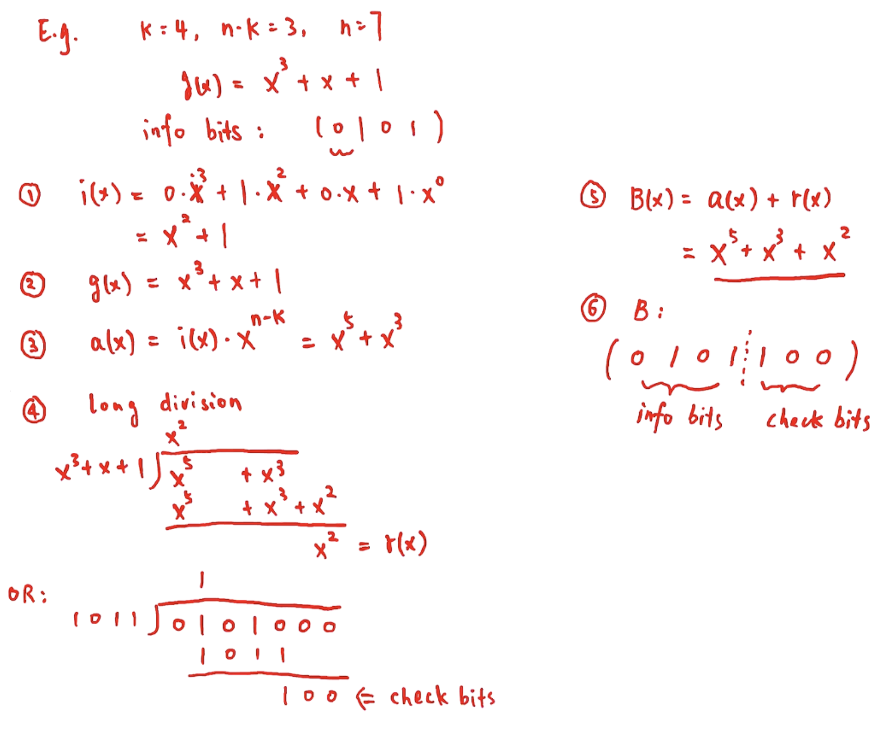

### CRC Pattern

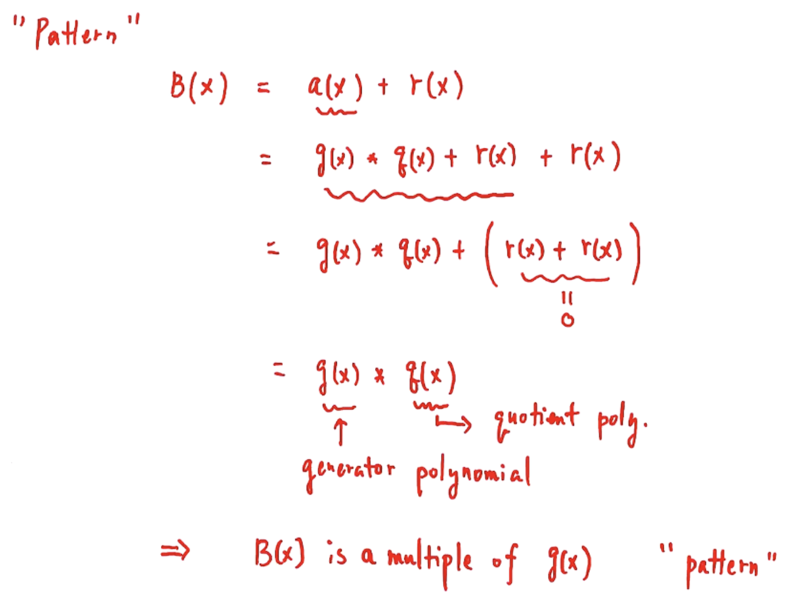

### Summary of CRC (Combined)

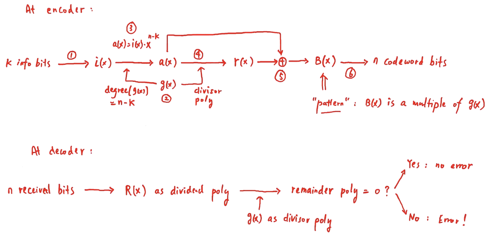

## Examples

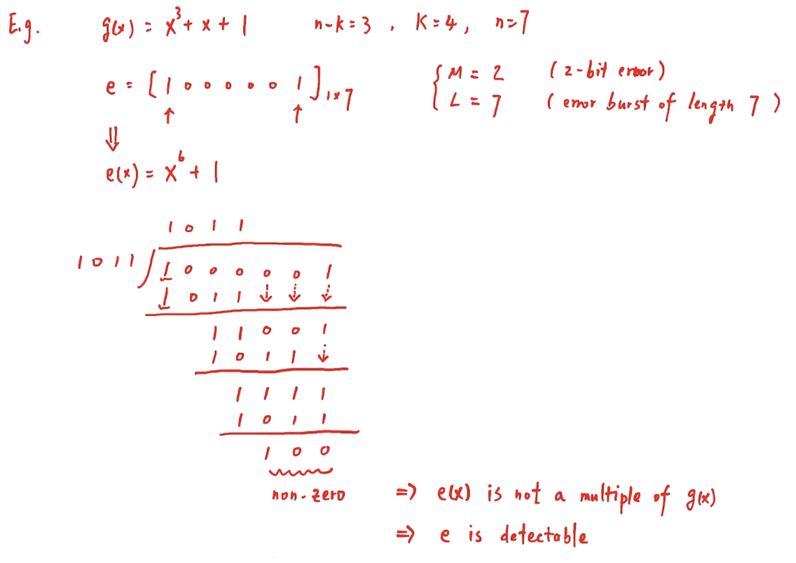

---

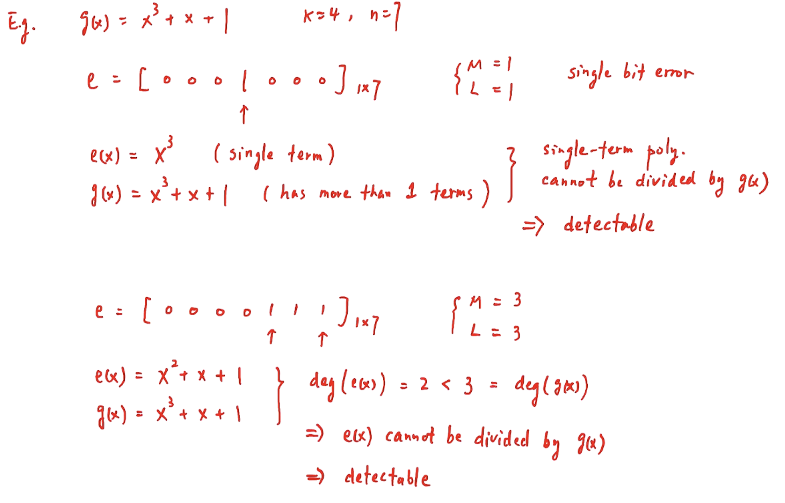

--- 

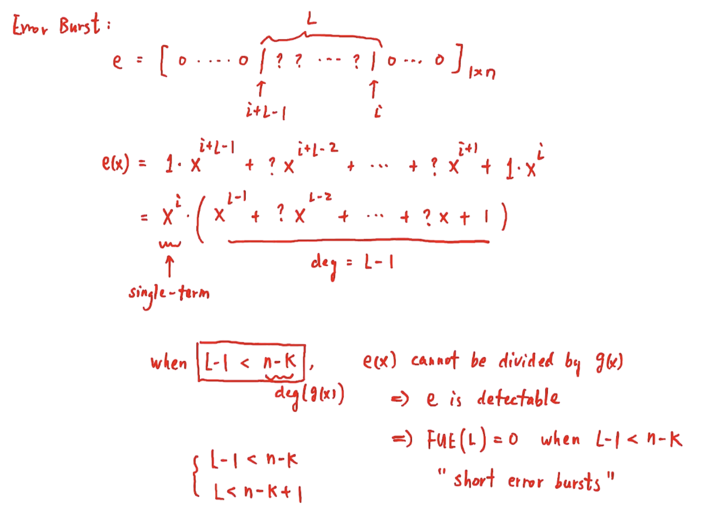

---

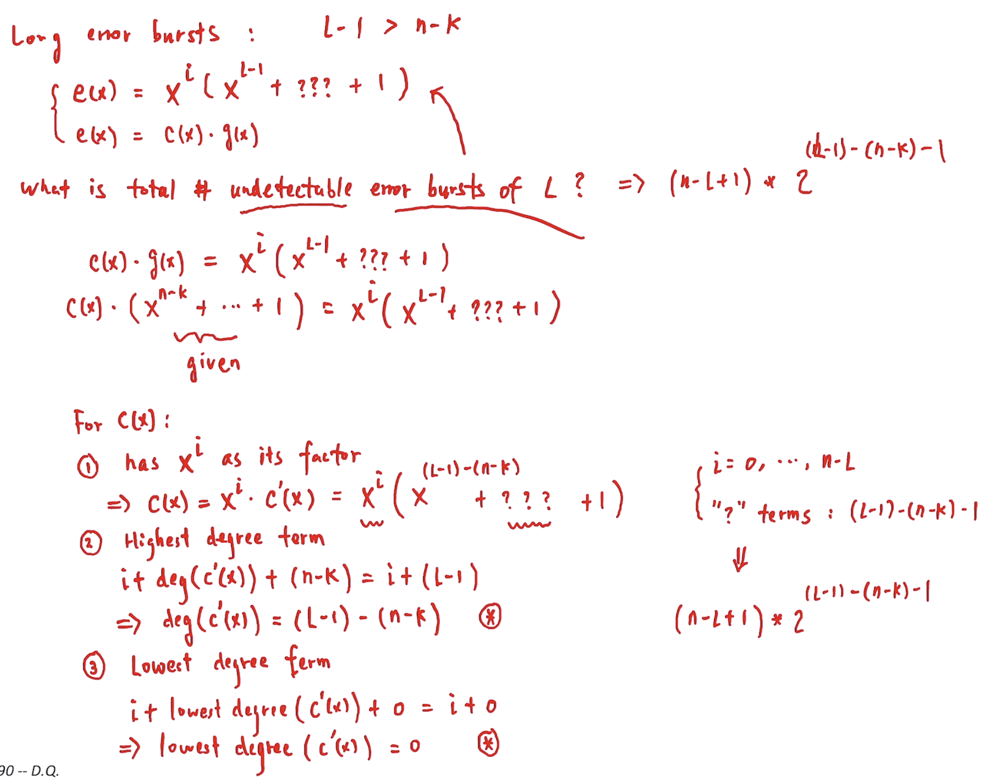

---

Formula.png)

---

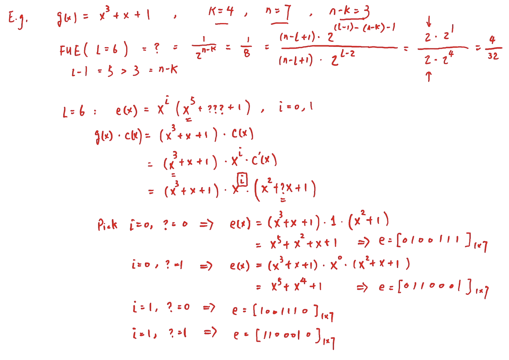

---

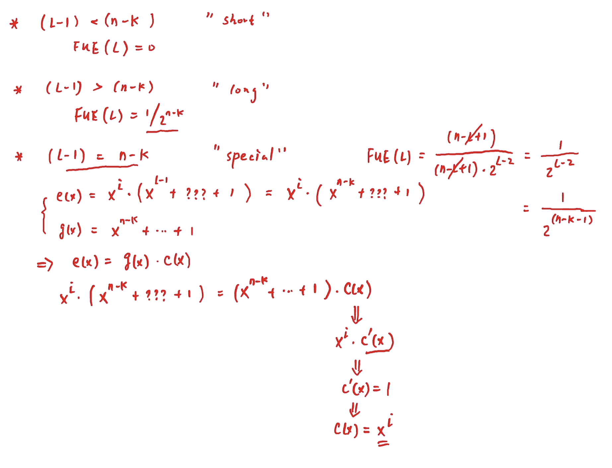

---

## Hardware Implementation of CRC

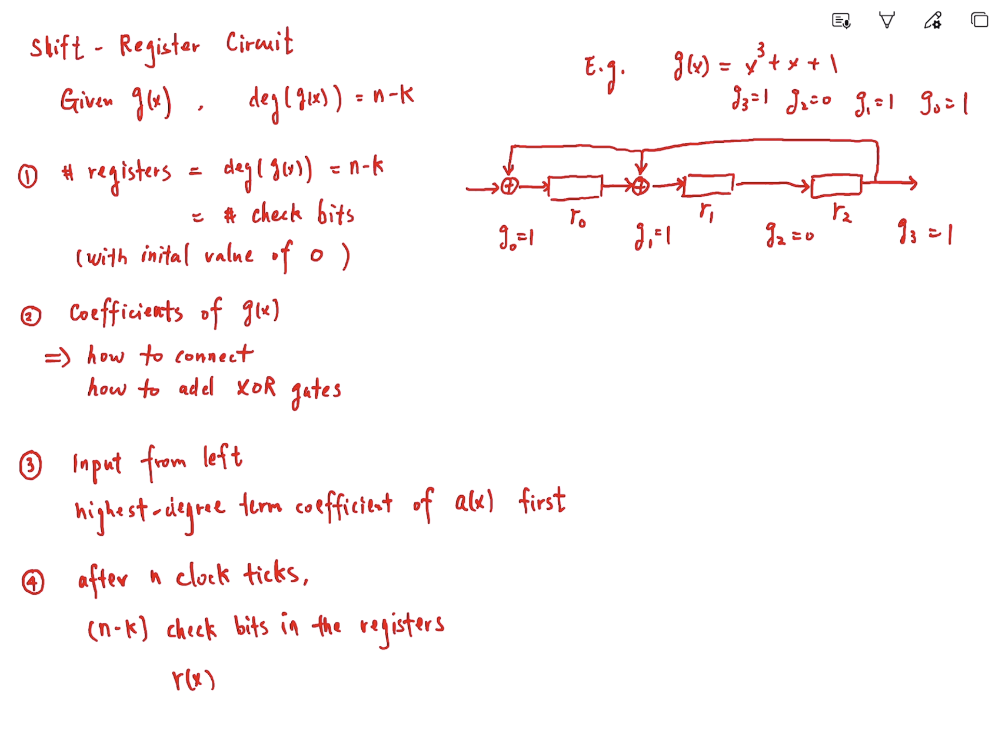

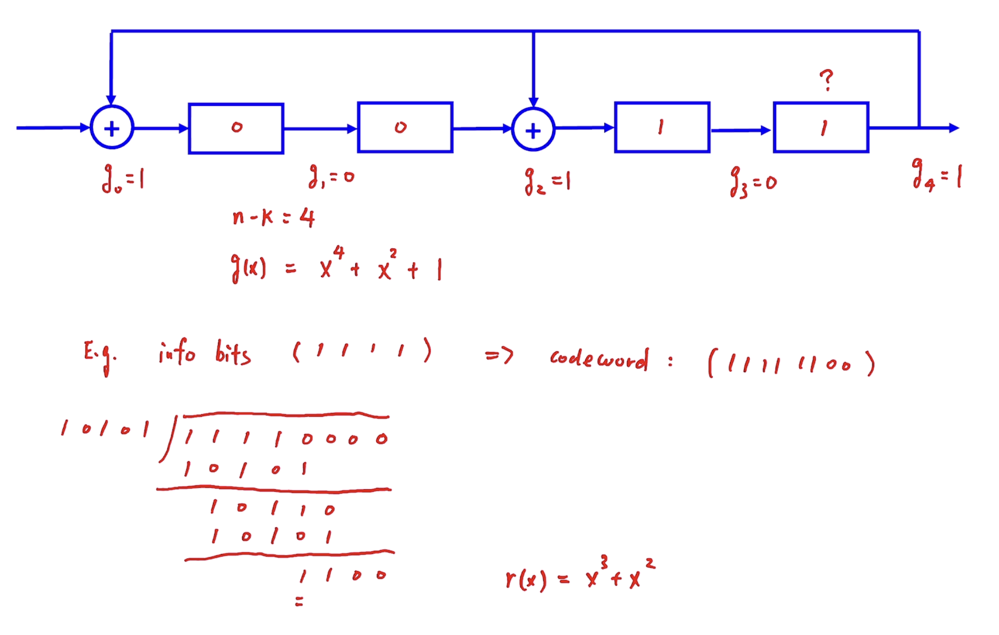

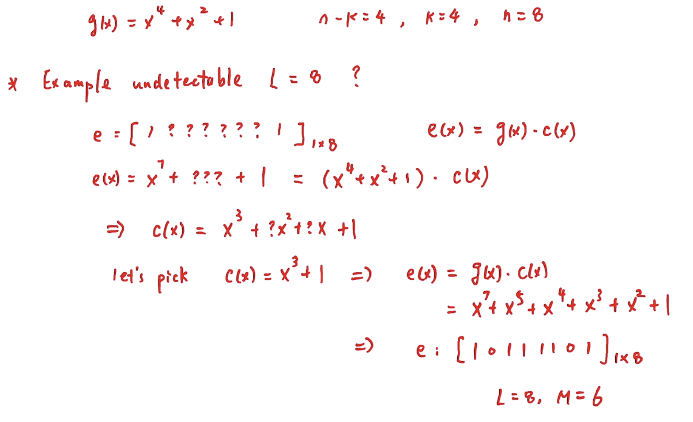

## Error Recovery

### ARQ (Automatic Repeat reQuest)

- Three Design Goals of ARQ Protocols
  - Goal #1: Ensure each data frame is delivered error-free
  - Goal #2: Ensure each data frame is delivered exactly once without duplication
  - Goal #3: Ensure data frames are delivered in order

---

#### 5 Basic Elements

1. Error Detection (CRC)
2. Control Frames: ACK (required), NAK (optional)
3. Retransmission (if needed)
4. Timeout
5. Sequence Number (SN)
   1. SN of data frame: position in the sequence
   2. SN carried in control frames: regarding whether or which data frames in the sequence have been received so far

"cumulative acknowledgement"
- Ex: ACK(20) => all data frames with SN < 20 have been received correctly.
              => the next data frame that the receiver is waiting for is #20.

