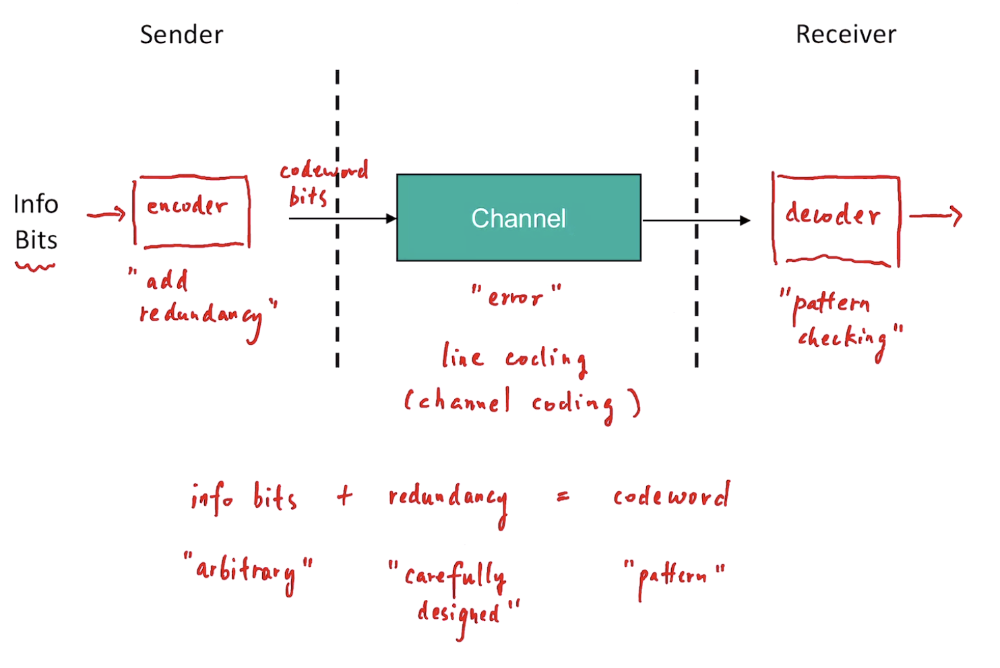
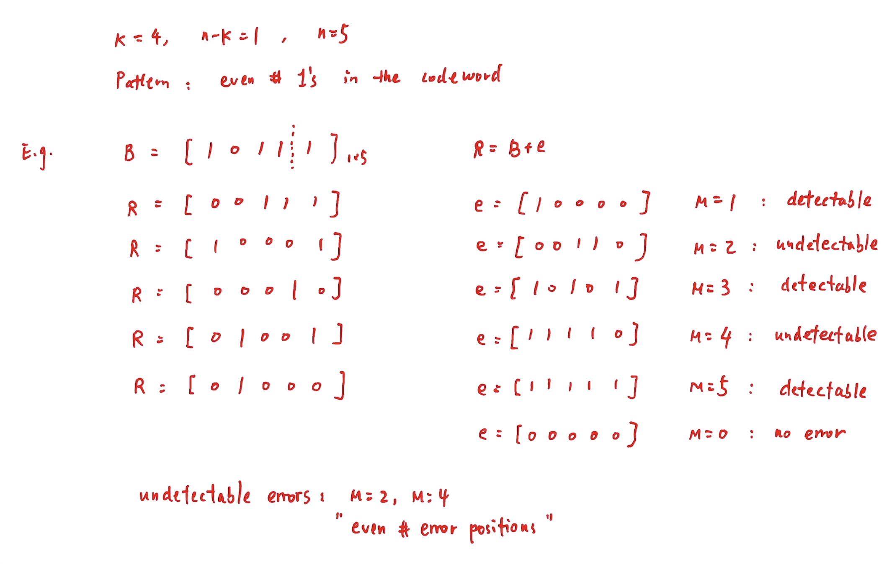
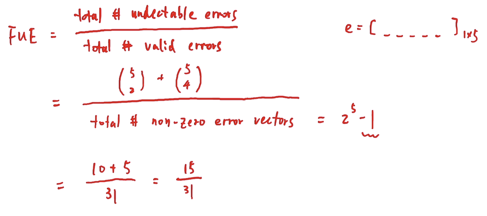
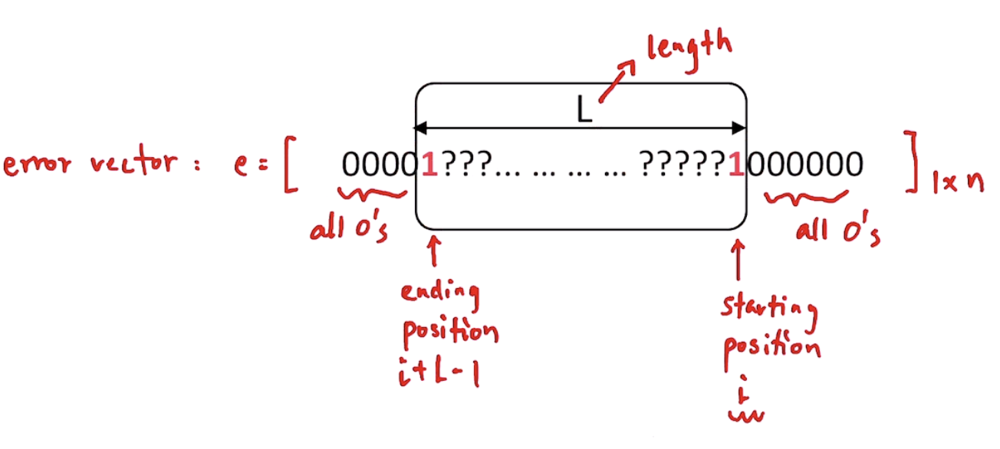
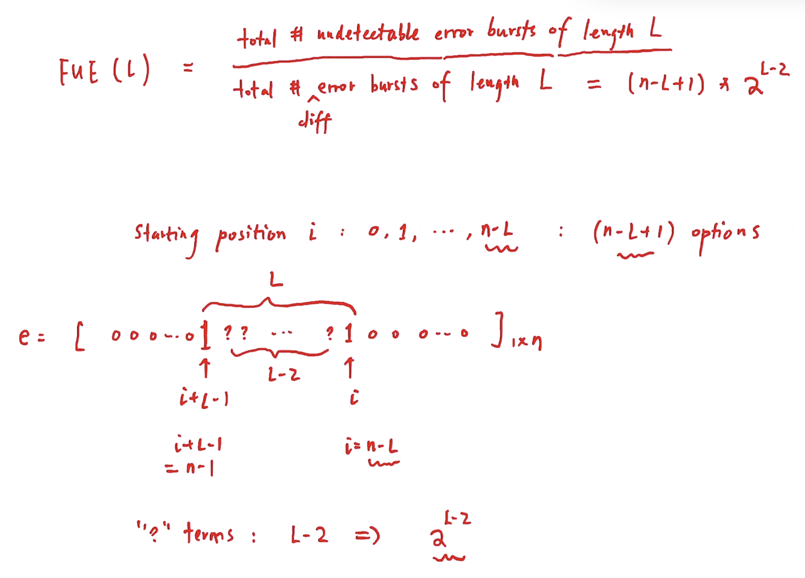
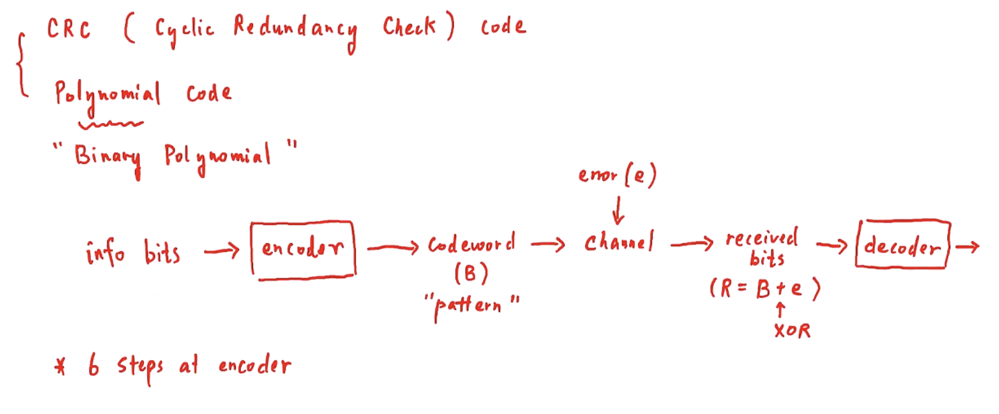
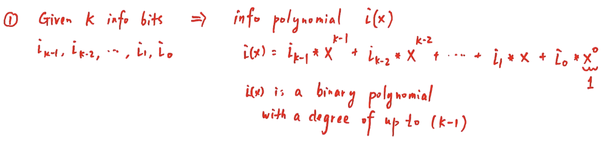
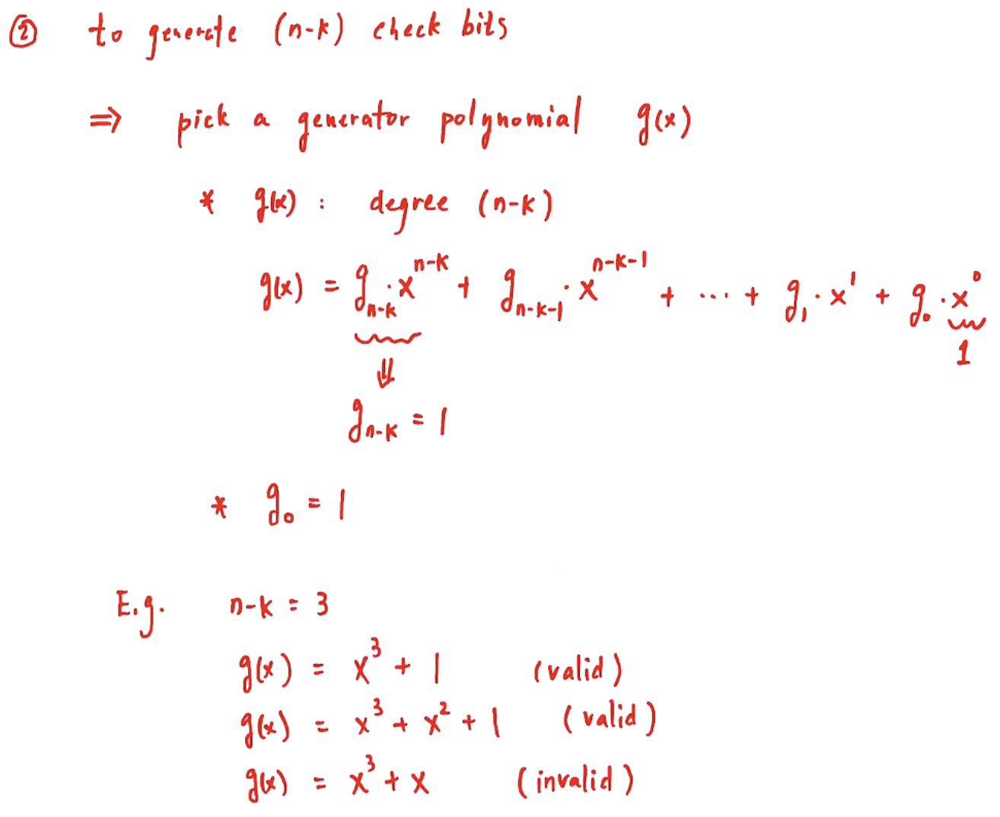
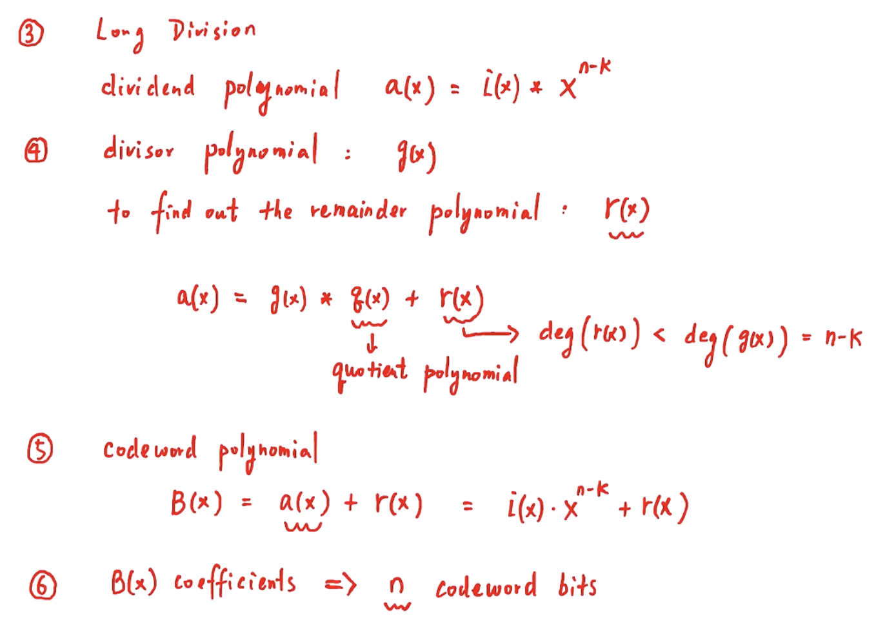
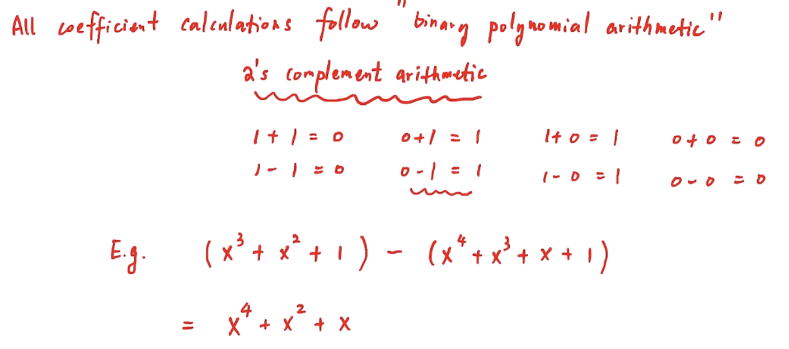

# Error Detection and Recovery

- k : # of info bits
- n - k : # of check/redundancy bits
- n : # of codeword bits (n > k)

## Error Vector

- Suppose we transmit a codeword that has n bits (B = [])
- Define the error vector e = [e(n-1), ... ,e(0)] where
  - e(i)=1 if error occurs to the ith bit
  - e(i)=0 otherwise
- Received (R) = codeword (B) `XOR` error vector (e)
- Fraction of Undetectable Errors (FUE)
  - FUE = total # undetectable errors / total # of valid errors

**Any even # bit errors are undetectable. Meaning 2 bit, 4 bit...**

## Error Burst

- Errors can be classified according to:
  - Number of bit error positions: M-bit error
  - Separation of bit error positions: error burst of length L
    - Error starts at bit position i and ends at bit position (i + L - 1)

.png>)

## Cyclic Redundancy Check (CRC) code

- 6 Step Approach at Encoder:
  1. Given k info bits => Information polynomial i(x)
     
  2. To generate/produce (n - k) check bits
     
  3. Divident Polynomial
  4. Divisor Polynomial
  5. Codeword Polynomial
  6. B(x) coefficients => n codeword bits
     

### 2's complement arithmetic

