# Physical Layer

## Digital Transmission in Computer Networks

### Purpose
Transfer a sequence of binary data (`0`s and `1`s) from a transmitter to a receiver.

### Method
Binary information is transmitted over a physical medium using **pulses and sinusoids**, subject to:

- Predefined signal formats
- Discrete symbols
- Finite symbol set
- Finite number of signal formats (pulses)

---

## Bit Rate

### Definition
**Bit rate** is the rate at which binary data is transmitted, measured in **bits per second (bps)**.

### Formula
Bit Rate (bps) = Coding Rate (bits/pulse) × Baud Rate (pulses/second)

### Key Definitions

- **Coding rate**
  - Number of bits represented by each signal format (pulse)
  - Determined by:
    - Pulse shape
    - Number of signal levels

- **Baud rate**
  - Number of pulses transmitted per second
  - Determined by:
    - Channel bandwidth
    - Transmission medium
    - Pulse shape

---

## Transmission Channel and Channel Bandwidth

### Channel Characterization

- Channels are characterized by their response to **sinusoidal input signals** at different frequencies.

### Amplitude-Response Function
A(f) = Output signal amplitude / Input signal amplitude

### Channel Bandwidth (W)

- Frequency range over which signals pass with acceptable attenuation.

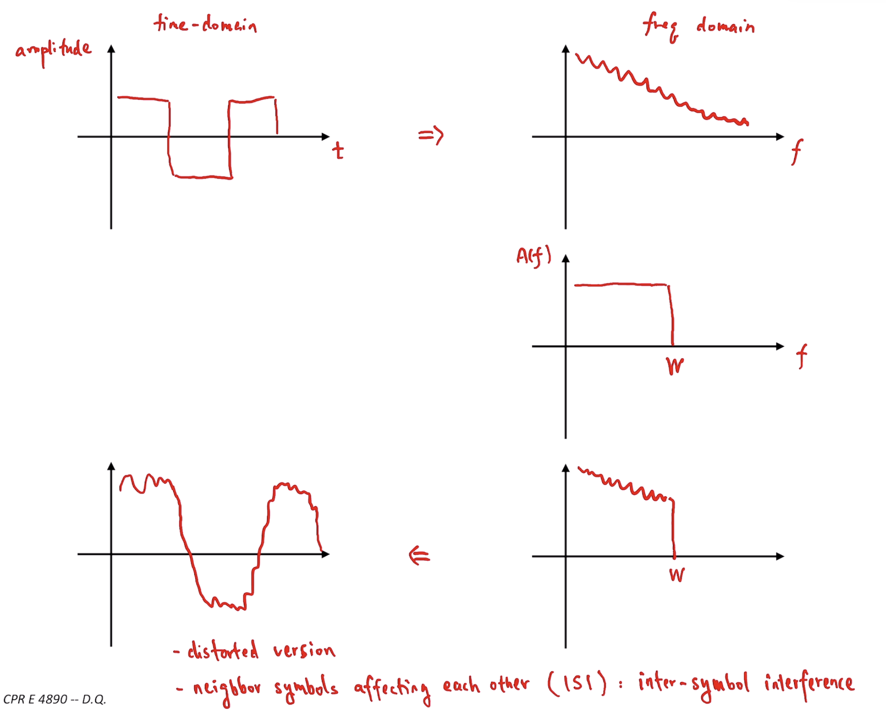

---

## Nyquist Rate

### Definition
The **Nyquist rate** is the maximum theoretical baud rate for an ideal, noiseless channel.

### Formula
r_max = 2W pulses/second

Where:
- `W` = channel bandwidth (Hz)

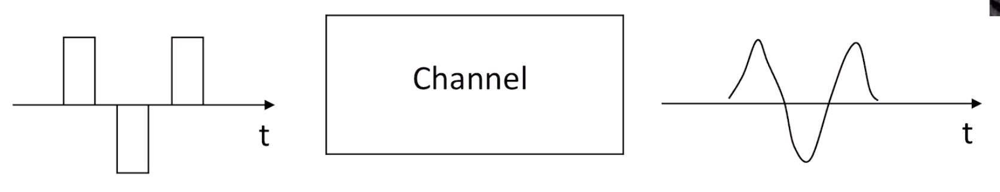

---

## Noise and Reliable Communication

### Impact of Noise

Noise:

- Limits accuracy of signal amplitude detection
- Restricts the number of usable signal levels
- Increases **Bit Error Rate (BER)**

---

### Signal-to-Noise Ratio (SNR)

SNR = Average Signal Power / Average Noise Power

- Larger SNR → Lower BER
- Smaller SNR → Higher BER

### SNR in Decibels
SNR(dB) = 10 log₁₀(SNR)

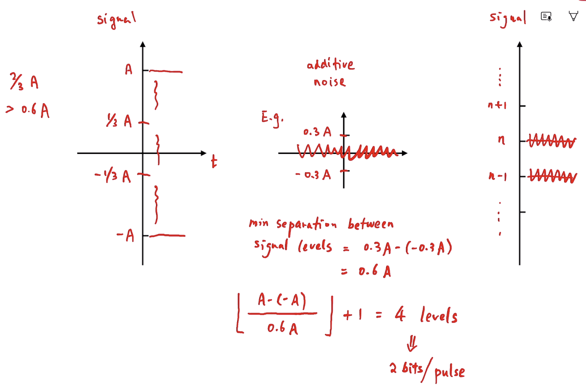

---

## Shannon Channel Capacity

### Formula
C = W log₂(1 + SNR) bps

Where:
- `C` = channel capacity
- `W` = channel bandwidth (Hz)
- `SNR` = signal-to-noise ratio (linear)

### Reliability Conditions

- If `R > C` → Reliable communication **not possible**
- If `R ≤ C` → Arbitrarily reliable communication **possible**

> Arbitrarily reliable means BER can be made arbitrarily small using sufficiently complex coding.

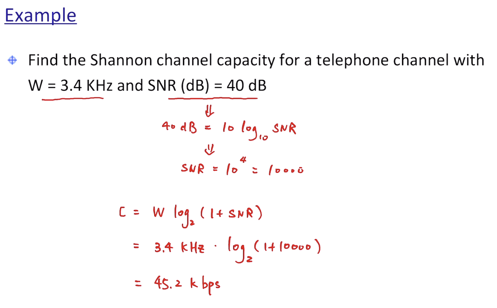
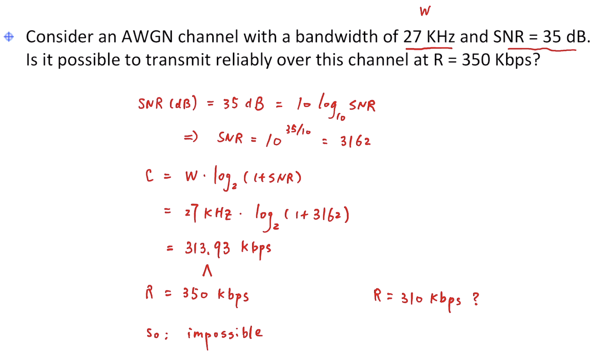
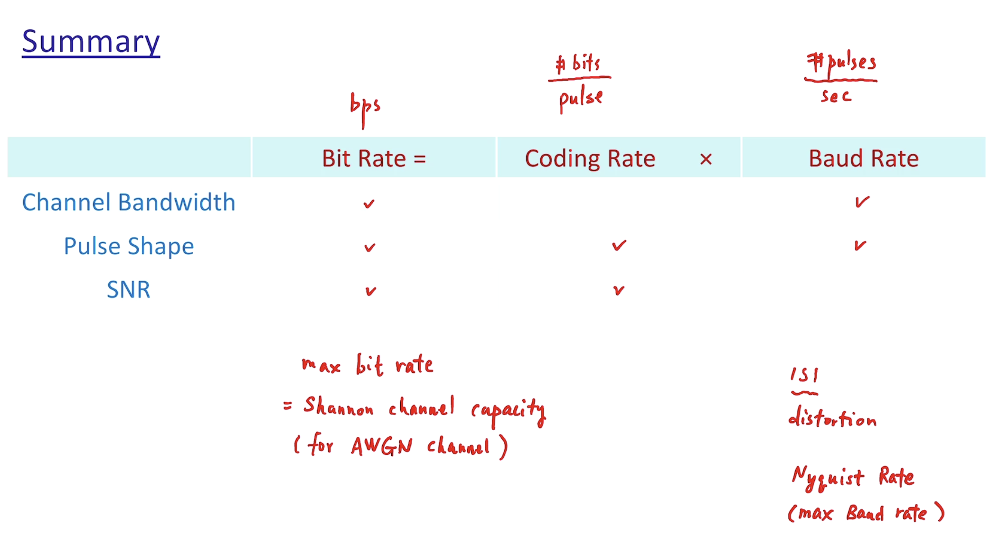

---

## Line Coding Schemes

Design Considerations:
- Time Recovery
- Low Complexity & Implementation Cost
- Low Power & Energy Efficient
- Better immunity to noise & interference
- Built-in error detecting capability

### 1. Unipolar NRZ

- `"1"` → `+A`
- `"0"` → `0`
- Drawback: Poor timing recovery, DC component

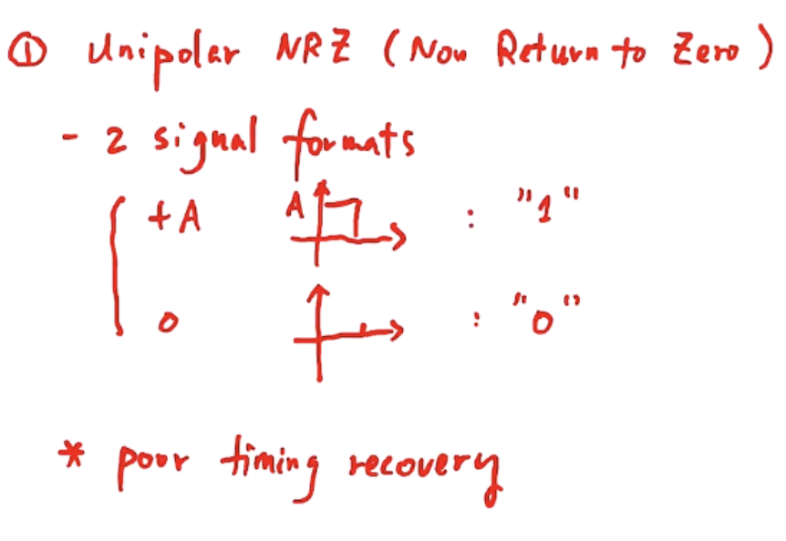

---

### 2. Polar NRZ

- `"1"` → `+A/2`
- `"0"` → `-A/2`

**Advantages**
- Simple, energy efficient
- Better noise immunity

**Drawback**
- Poor timing recovery

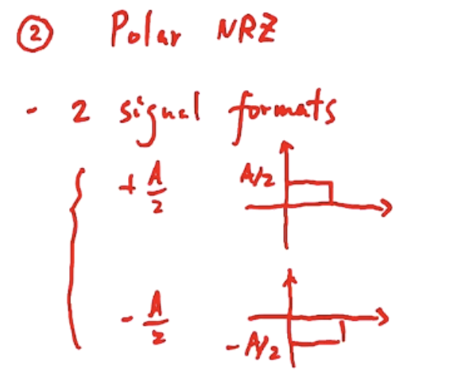

---

### 3. Bipolar Coding

- `"1"` → Alternates between `+A/2` and `-A/2`
- `"0"` → `0`

**Features**
- Zero DC component
- Zero substitution codes: B8ZS, B6ZS, B3ZS

**Drawback**
- Long runs of zeros cause synchronization loss
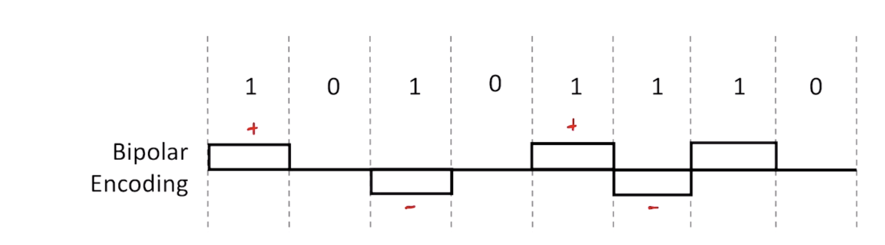
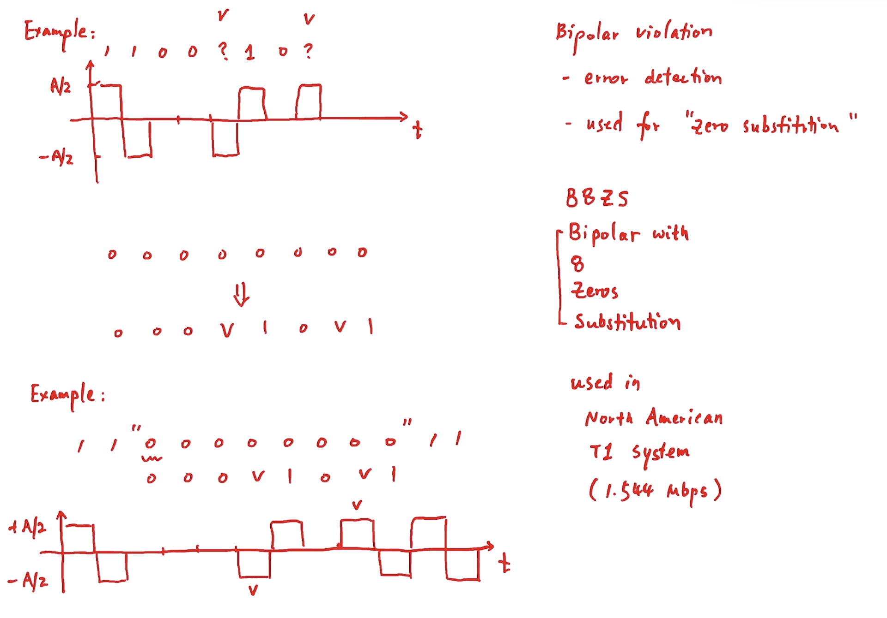
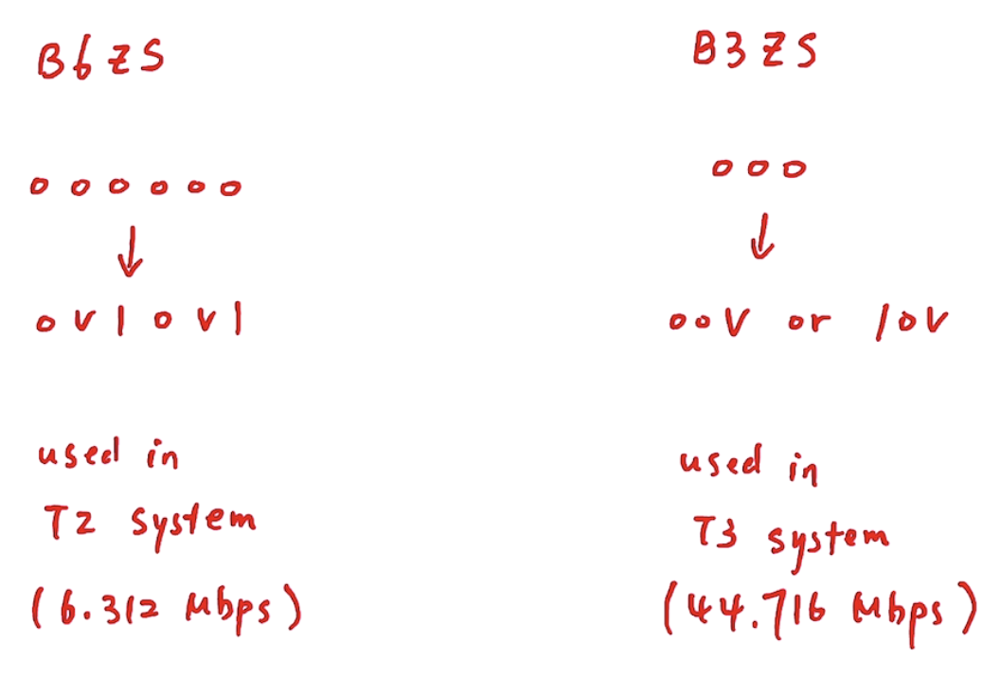

---

### 4. Manchester Coding (also known as 1B2B)

- `"1"` → `+A/2 → -A/2`
- `"0"` → `-A/2 → +A/2`

**Characteristics**
- Self-clocking
- Excellent timing recovery

**Coding Rate**
Coding rate = 1 bit / 2 pulses = 1/2 bit per pulse
Bit rate = (1/2) × Baud rate

**Example**
10 Mbps → 20 MHz baud rate
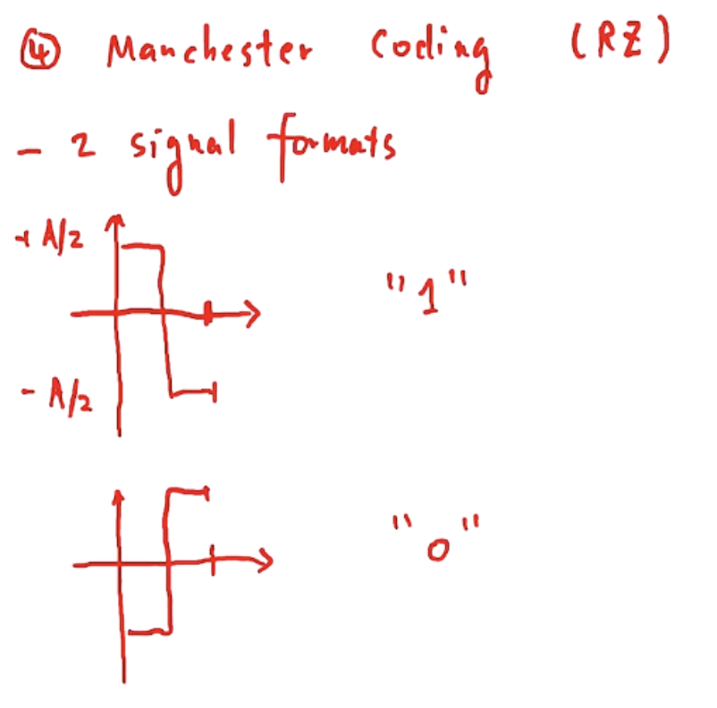
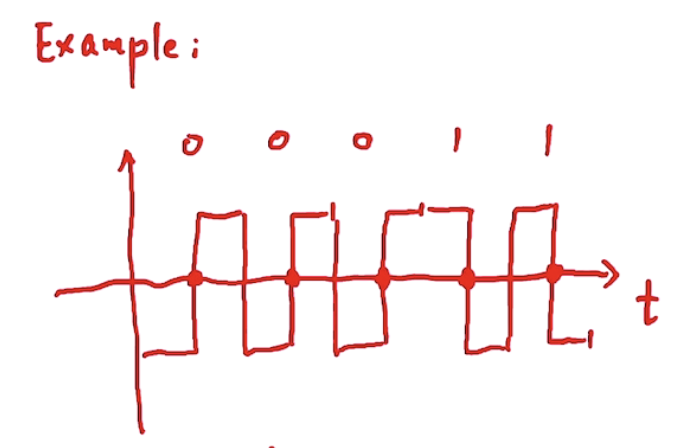
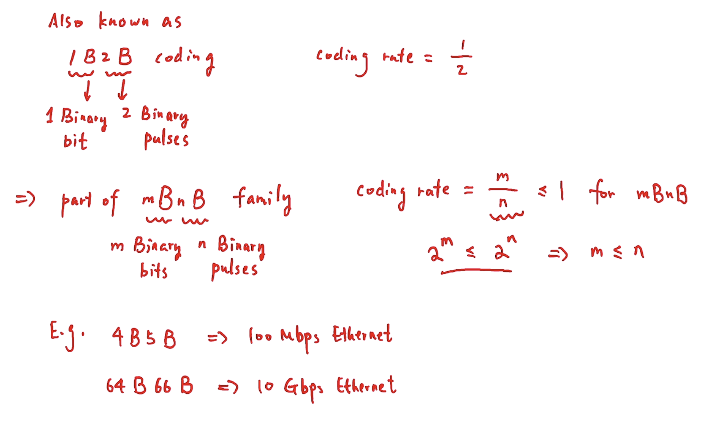

---

### 5. mBnL Coding

- `m` bits
- `n` pulses
- `L` signal levels

**Constraint**
2^m ≤ L^n

**Coding Rate**
Coding rate = m / n

**Examples**
- 2B1Q → 2² ≤ 4¹
- 4B3T → 2⁴ ≤ 3³

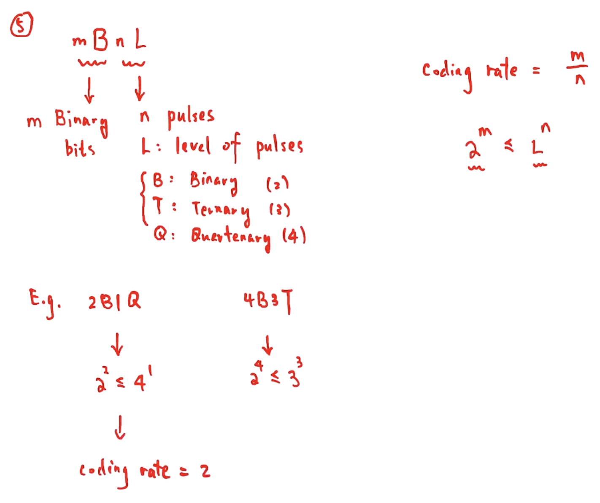
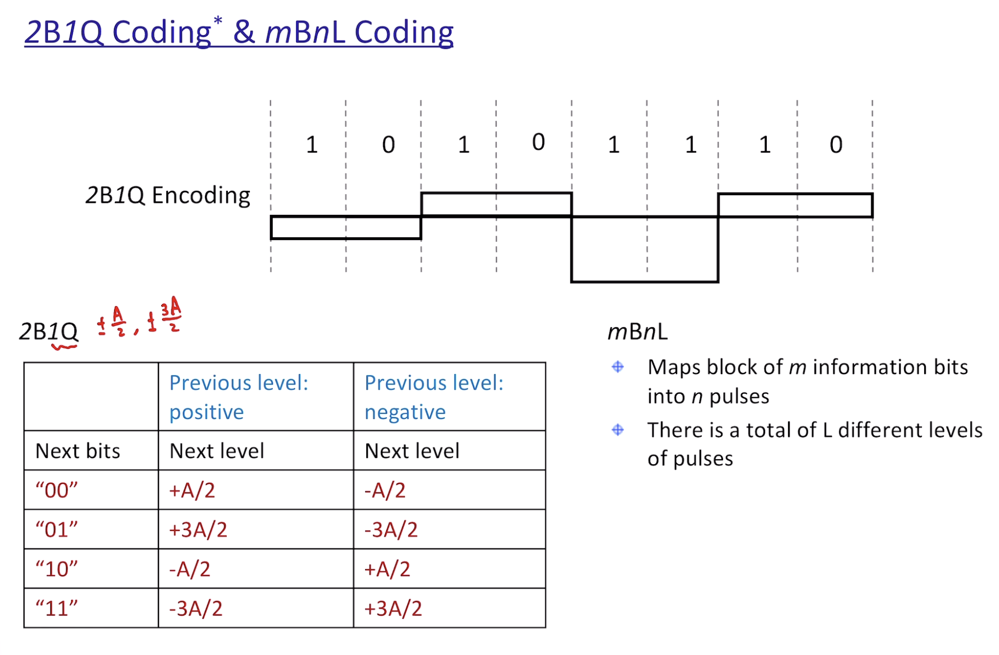

---

### 6. NRZ Inverted (NRZI)

- `"1"` → Transition at bit start
- `"0"` → No transition

**Properties**
- Differential encoding
- Polarity insensitive
- Errors occur in pairs

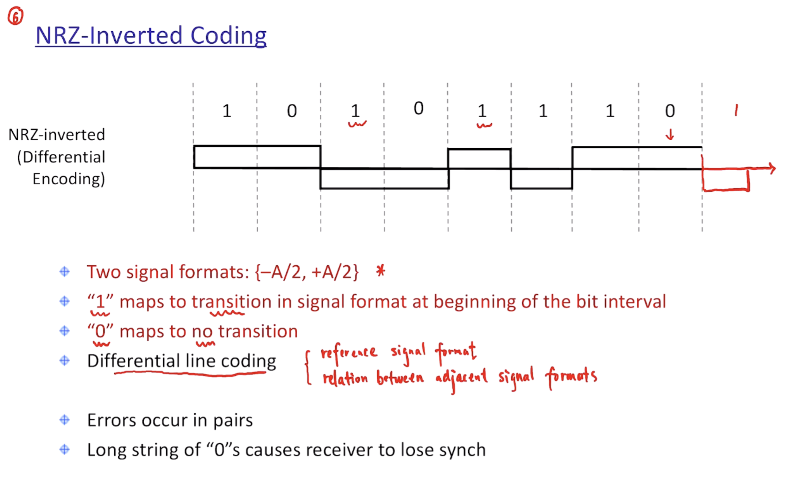
---

### 7. Differential Manchester Coding

- `"1"` → Transition at beginning
- `"0"` → No transition at beginning
- Mid-bit transition always occurs

**Characteristics**
- Polarity insensitive
- Excellent clock recovery
- Errors occur in pairs

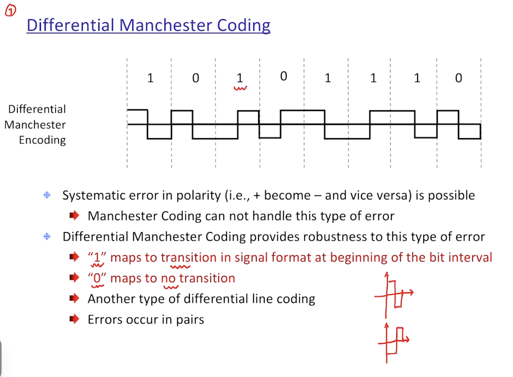