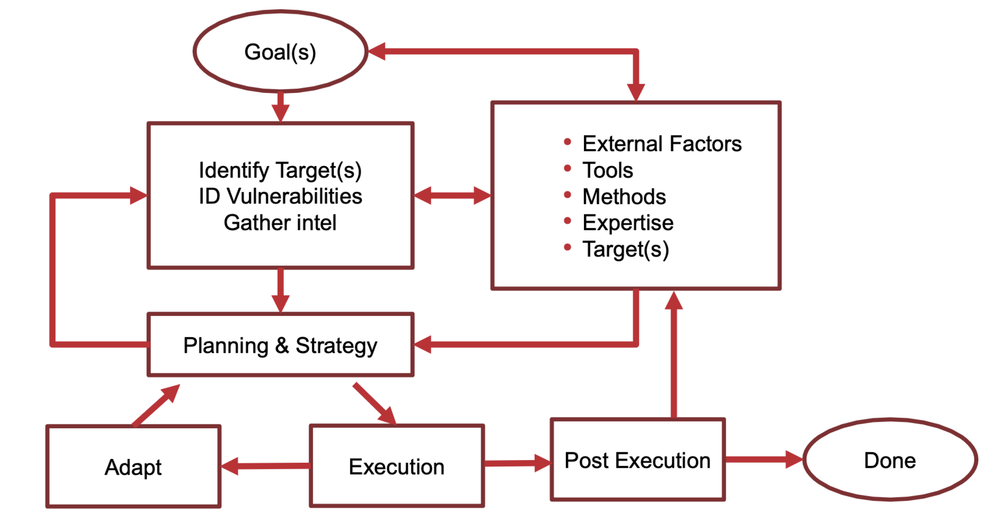

# Introduction to Adversarial Thinking

## What is Adversarial Thinking?

### What is an Adversary?

- An adversary is an individual, group, or entity that opposes or acts in conflict against another. In various contexts, adversaries seek to achieve specific goals, often at the expense of others.
- They work across multiple domains.

### Characteristics of an Adversary

## The Adversarial Process

## Understanding the Adversary's Mindset

### Define Goals, Motivation, and Objectives

- **Goals are the specific outcomes.**
- **Motivation is the driving force.** It's why an adversary engages in certain behaviors or chooses a specific course of action. (Ideological beliefs, Desire for revenge)
- **Objectives are specific, concrete steps** that need to be achieved in pursuit of a goal. They are more precise and measurable.

### Defining Goals: The "What"

- Characteristics:
  - Concrete and Measurable
  - Outcome-Focused
  - Can Evolve Over Time

### Defining Motivation: The "Why"

- Characteristics:
  - Internal or External
  - Broad and Abstract
  - Influences Decision-Making

### Defining Objectives: The "Steps"

- Characteristics:
  - Specific, Clear, and often Quantifiable
  - Short to medium-term targets or milestones
  - Directly actionable and serve as steps towards achieving a broader goal

### Goals vs Objectives

- While goals provide a general direction, objectives are the specific steps
  taken to achieve these goals.

### Adversary's Motivation, Goals, and Objectives

- Political Motivations
- Economic Motivations
- Ideological/Religious Motivation
- Personal Motivations
- Technological Motivations
- Strategic/Military Motivations

### Crosscutting Goals of Adversaries

- Espionage
- Disruption
- Reputation Damage
- Resource Control
- Social Engineering
- Intimidation/Coercion
