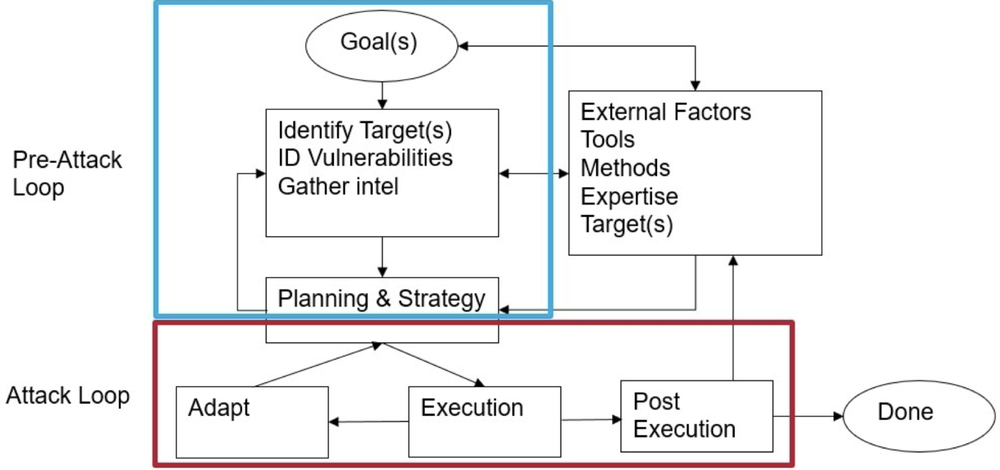
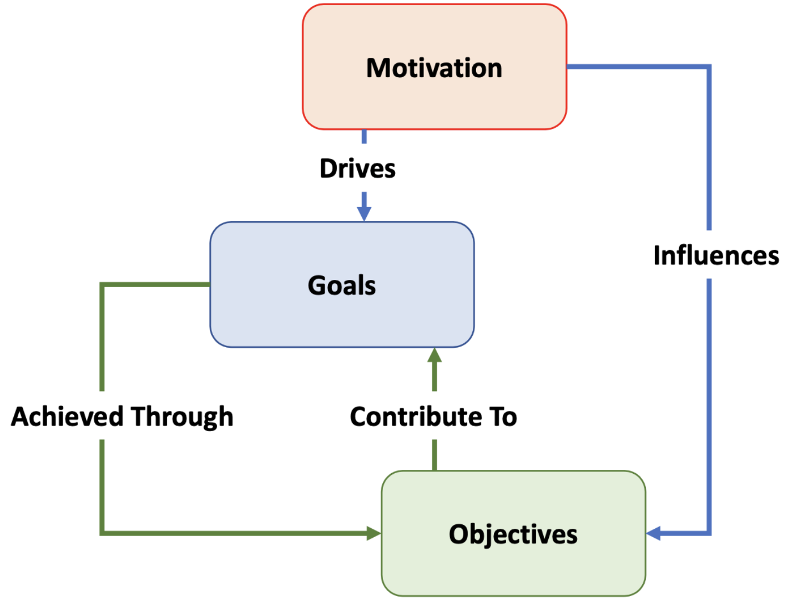

# Module 2: Introduction to Adversarial Thinking

---

## What is an Adversary?

An adversary is an individual, group, or entity that opposes or acts in conflict against another, seeking to achieve specific goals — often at the expense of others. They operate across multiple domains (physical, cyber, social, etc.).

---

## The Adversarial Process

---

## The Adversarial Mindset: Goals, Motivation & Objectives

These three concepts are distinct but deeply connected:

- **Goals** — the specific outcomes an adversary wants to achieve. They are concrete, measurable, outcome-focused, and can evolve over time.
- **Motivation** — the *why* behind the adversary's actions. Can be internal or external, tends to be broad and abstract, and directly influences decision-making (e.g., ideological beliefs, desire for revenge).
- **Objectives** — the *steps* taken to reach a goal. Specific, quantifiable, short-to-medium-term milestones that are directly actionable.

**In short:** Goals give direction, motivation provides the driving force, and objectives are the concrete steps that get you there.

---

## Types of Adversarial Motivation

- **Political** — influence or destabilize governments and policy
- **Economic** — financial gain or competitive advantage
- **Ideological/Religious** — advance a belief system or cause
- **Personal** — revenge, grievance, or personal gain
- **Technological** — acquire or disrupt technology and IP
- **Strategic/Military** — gain tactical or geopolitical advantage

---

## Crosscutting Goals of Adversaries

Regardless of motivation, adversaries tend to pursue a common set of objectives:

- **Espionage** — covert intelligence gathering
- **Disruption** — degrading systems, services, or operations
- **Reputation Damage** — undermining trust in a person or organization
- **Resource Control** — acquiring or denying access to assets
- **Social Engineering** — manipulating people to achieve access or information
- **Intimidation/Coercion** — using threats to influence behavior