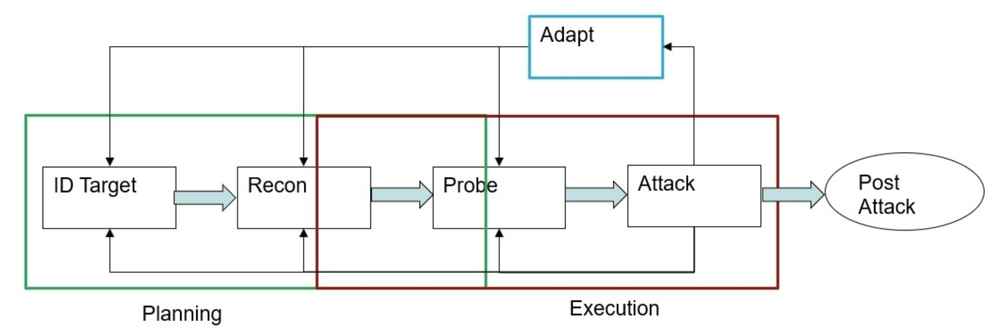

# Cyber-Enabled Adversary

## Introduction

### Why do adversaries use cyber?

- Accessibility and Reach
  - conduct operations remotely
  - enables them to impact targets beyong physical location
- Anonymity and Low Risk Detection
  - difficult to trace attacks back to perpetrator
  - reduces risk of detection and subsequent legal consequences
- High Impact with Lower Resources
  - can achieve significant disruption or damage with fewer resources
  - costs lower than a physical operation
- Reconnaissance
  - gather info about target
  - includes scanning for network vulnerabilities, researching employee info for social engineering, or identifying valuable data for theft
- Exploitation of Digital Dependence
  - modern world is heavily reliant on digital infra
  - adversaries exploit this dependence (causing maximum disruption, steal valuable data, gain strategic advantage)
- Versatility and Scalability
  - cyber tools and tactics can be adapted to wide range of objectives
  - can also be scaled to impact single individual or an entire nation
- Speed and Efficiency
  - can be executed rapidly (often in real-time)
  - allowing for exploiting vulnerabilities before they can be addressed
- Exploiting Vulnerabilities
  - tools such as malware, ransomware, phishing techniques
  - exploit technical or human vulnerabilities to gain unauthorized access to systems

### How Adversaries use Cyber

- Cyber to aid in physical attack
- Cyber-only attacks
- Physical attack to aid in a cyber attack

### Cyber to Aid in Physical Attack

- Intelligence Gathering:
  - collect info about target, such as security protocols, layout of facility, and schedules
- Disabling Security Systems:
  - alarms, surveillance cameras, or access control systems (making physical intrusion easier)
- Communication Disruption:
  - hinder the target's ability to respond effectively to the physical attack
- Manipulating Operational Technology:
  - in industrial target cases operational technology can be manipulated to create physical vulnerabilities or distractions

### Cyber-Only Attack

- Data Breach
- Financial Theft
- Ransomware Attacks
- Espionage
- Disruption and Sabotage
- Estabilishing Persistence (seek to maintain long-term access)
- Manipulation and Disinformation

### Physical Attack to Aid in a Cyber Attack

- Hardware Interference
  - tampering with devices to install malware, such as USB drops or hardware modification
- Access to Restricted Areas
  - gaining physical access to secure locations to breach network security
  - plugging into a network port within a secure facility
- Interception of Equipment
  - intercepting and modifying hardware during transit
  - implanting surveillance tools or backdoor in technology products

### Additional Considerations

- Hybrid Attacks
  - combination of physical and cyber attacks in a coordinated manner
- Social Engineering
  - both in physical and cyber realms
- Supply Chain Attacks
  - targeting a supplier or third-party service provider to compromise the primary target (can be physical or cyber)

## Cyber-Enabled Adversarial Tactics

### Who is the Cyber Adversary?

- Expertise
  - Script Kiddies
  - Amateur
  - Professional
- Methods
  - Remote Access
  - Social Engineering
  - Physical Access

#### How are they organized?

- Individual
- Cause based
- Lose collective
- As a business
- State based
  - State supported
  - State sponsored
  - State run

### What are their goals?

They can be inter-related and often tied to money.

- Data
- Trust
- Disruption
- Influence

#### Goal #1: Money

- Theft
  - Redirection/diversion
  - Account access
  - Purchasing
  - Fraud
  - Ransomware

#### Goal #2: Data

- Types
  - Personal Identifiable Information (PII)
  - Records, operational and infra plans
- Threats
  - Disclosure
  - Reuse (ID theft, bank accounts)
  - First step to another attack
- Holding it hostage for money

#### Goal #3: Disruption

- Physical services
  - Power, Traffic, Water, Gas
  - Building control, medical
- IT Services
  - 911, communications
  - Medical, government services
- Holding it hostage for money

#### Goal #4: Influence

- Personal Attacks (often demanding money)
  - Swatting
  - Fake messages, kidnapping, family arrested
  - Direct threats
- Public attacks to cause fear
  - Disruption - Ransom = Terror
  - Sole purpose is not to gain money but to cause chaos and fear

#### Goal #5: Public Trust

- Eroding trust in:
  - Government
  - Elected Officials
  - Certain Services
  - Elections
  - Company brands

### Executing the Attack

#### How They do it: Attacks of Opportunity

- Often carried out by script kiddies
- Pick on vulnerable systems, not installing patches
- Misconfigured systems
  - Initial config problems
  - Reconfig problems
- General social engineering

#### How they do it: Advanced Persistent Threat

- Attackers pick their target(s) and will wait until you make a mistake
  - Misconfig
  - Not patching a system
- Or they target your employees with phishing emails
  - Get them to disclose passwords
  - Go to websites to get malware
  - Send attachments with malware

#### Advanced Persistent Threat - Likely Targets

- The internet of things (IoT):
  - Water, Power, Transportation, etc
- Where the money is:
  - Banks, People, Organizations (lower tech = targets)
- Intellectual Property:
  - Technology (ag sector, manufacturing, etc)
- Gain Access

#### What they target: Vulnerabilities

#### Vulnerable Systems

- Attackers pick on vulnerable systems
- Bad access control
- Misconfig systems
  - Initial config problems
  - Reconfig problems
  - Not installing patches or old systems
  - Zero day

#### Types of Systems

- Data Systems:
  - contain critical data
  - IP, credit card numbers, etc
- Processes Systems:
  - needed for operation
  - often part of ransomware attacks
  - billing, inventory, medical
- Control systems:
  - controls physical assets
  - pipelines, power grid, traffic control

#### Vulnerable People

- People are the weakest link. Over 50% of data loss is from social engineering, which is a tactic used by attackers directly against people.
- Malware (ransomware):
  - phishing and spear phishing
  - email attachments
  - websites
    - drive by
    - directed
  - poor access policies

#### How they do it: People on the Inside

- Often easier to get someone on the inside to:
  - Install Malware
  - Transfer money
  - Expose data
  - Allow access

#### Attackers Use People on the Inside

- Intentional: Think of the number of egress points and the number of protocols involved
- Accidental: As applications become more integrated and seamless, it becomes easier to send data
- Intentionally Accidental: As we harden our defenses, the attackers
  are using more social engineering-based attacked to get users to

#### Vulnerable Processes

- Internal processes
  - Gather information
  - Use knowledge of processes against you
- External processes
  - Supply chain security
  - Partner security

### Examples

#### Data Systems - Examples

- New ransomware - Encrypt and Steal
  - Threaten release of data
  - Police info, PII, etc
- Target
  - Malware (through supplier), Theft of CC #
- Sony
  - Malware, APT, Disruption, Revenge

#### Target - Examples

- Attackers had malware that reads memory and sends it to a drop site
- Unclear if they picked certain retailers or just looked for ones, they could insert the malware
- Used weak security at HVAC company to get login name and password to Target
- Tested software Nov 15-28
- Nov 30 pushed to most POS terminals
  .png>)

#### Example: Sony

- Still unclear how they gained access
- Appears to be APT
- Attackers raised the stakes in this, one of the first attacks that caused widespread destruction of computing resources
  - Well written and very complex malware

#### Process Systems - Examples

- Hospitals
  - Ransomware, shutdown medical systems
- Colonial pipelines
  - Ransomware, effected business processes
- JBS
  - Ransomware, effected business processes
- Co-op
  - Effected grain handling and farmer data

#### Control Systems - Examples

- Florida water plant
  - Remote access, added toxic chemical
- Ukraine power grid
  - Russian attack
- Iranian centrifuges
  - Changed sensor data
  - Also, a process vuln

#### Example: Turkish Pipeline

- 2008, some reports one of the earliest cyber physical attacks
- Gained access via internet cameras
- Changed settings
- Turned off monitors

#### People Vulnerabilities - Examples

- 2016 DNC email leak
- 2020 Twitter bitcoin scam
