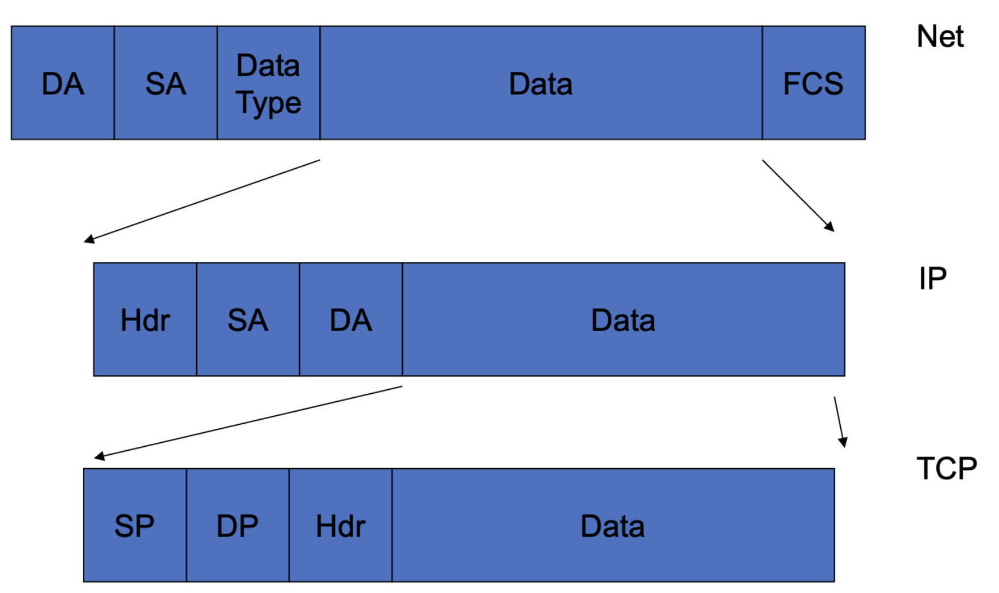
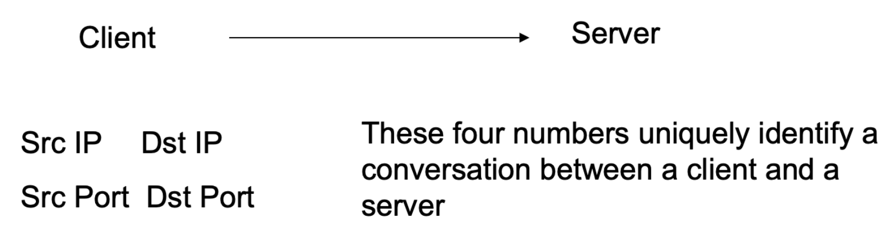

# Module 4: Ethics & Networking Intro

---

## Information Assurance (IA)

The four pillars of information assurance:

- **Confidentiality** — ensuring information is accessible only to authorized parties
- **Integrity** — ensuring information is accurate and unaltered
- **Availability** — ensuring systems and data are accessible when needed
- **Policy / Privacy** — governing how data is handled and who can access it

---

## Legal Issues in Cybersecurity

### Types of Law
- **Criminal Law**: Requires proof "beyond a reasonable doubt." Cybercrime is relatively new, so the legal system is still catching up — juries often struggle to understand technical details, making prosecution difficult. Newer laws have led to more cybercrime prosecutions.
- **Civil Law**: Requires only a >50% standard of proof ("preponderance of evidence"). More common in intellectual property disputes, defamation, and harassment cases.

### Key Legal Challenges
- **Unauthorized access laws** are often ambiguous and hard to prosecute
- **Setting damages** in civil cases is difficult
- Software companies have historically not been sued for security bugs, though this may change as breaches become more severe
- **International jurisdiction** creates major complications — laws differ across borders, and attribution is difficult

### Types of Protected Information
- Copyright
- Unauthorized access statutes
- Theft laws
- Domain-specific regulations (e.g., HIPAA for medical information)

---

## Ethical Issues in Cybersecurity

Security professionals often have access to everything on a network, which creates significant ethical responsibilities:

- **Privacy vs. Monitoring**: Monitoring employee activity (traffic, keystrokes, browsing) may be technically legal but raises serious ethical questions around privacy and dignity
- **First Amendment**: Free speech considerations apply in certain monitoring contexts
- **Productivity Monitoring vs. Surveillance**: Monitoring for productivity or policy violations (sexual harassment, defamation) can cross into invasive territory

> Just because technology *allows* something doesn't mean society *should* permit it. Technology is consistently outpacing the rules and regulations meant to govern it.

---

## Access Methods (Attack Surface)

| Access Type | Mode | Examples |
|-------------|------|---------|
| **Physical** | At rest | Accessing a stored device or file |
| **Physical** | In motion | Lost laptops, improperly discarded data |
| **3rd Party Physical** | Deliberate | Untrusted insider with physical access |
| **3rd Party Physical** | Accidental | Untrained insider mishandling data |
| **Network** | Active | Break-in, exploitation |
| **Network** | Passive | Traffic sniffing/eavesdropping |
| **Network** | Social | Using the network to cause a third party to expose data |

---

## Networking Overview

### Core Concepts

- A vulnerability in an **application** can take that app offline
- A vulnerability in the **OS** can take the entire system down
- **Addressing** is a common problem area:
  - Every device on the same media needs a hardware (MAC) address
  - IP addresses provide globally unique identifiers at the network layer
  - Critically: **addresses are not verified** — an attacker can spoof any source IP address they choose

### Protocols
- **TCP** — connection-oriented, reliable delivery
- **UDP** — connectionless, faster but no delivery guarantee
- **Port numbers** — identify which application on a host should receive a packet (e.g., port 80 for HTTP, port 443 for HTTPS)

### Network Devices

- **Hub**: Broadcasts every packet to all connected devices — all machines see all traffic
- **Switch**: Forwards packets only to the correct destination device
- **Router**: Connects networks together; uses routing tables to forward packets based on destination IP and metrics (e.g., fastest path)

### Client/Server Model

- The **server** binds to a port and waits for incoming connections
- The **client** initiates a connection to the server's address and port
- The OS filters and discards packets that don't match the bound address

### Routing
- Routers maintain **routing tables** containing IP ranges their neighboring routers can handle
- Routers do not need to know the full topology of the internet — they only need to know what their neighbors can reach
- Routes are chosen based on destination address and path metrics (e.g., hop count, latency)