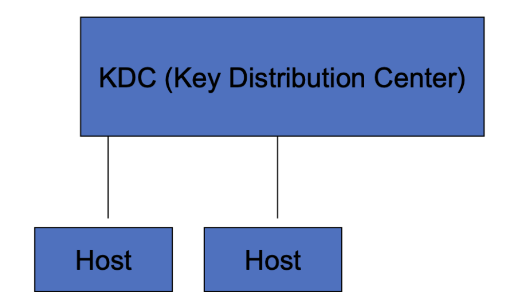
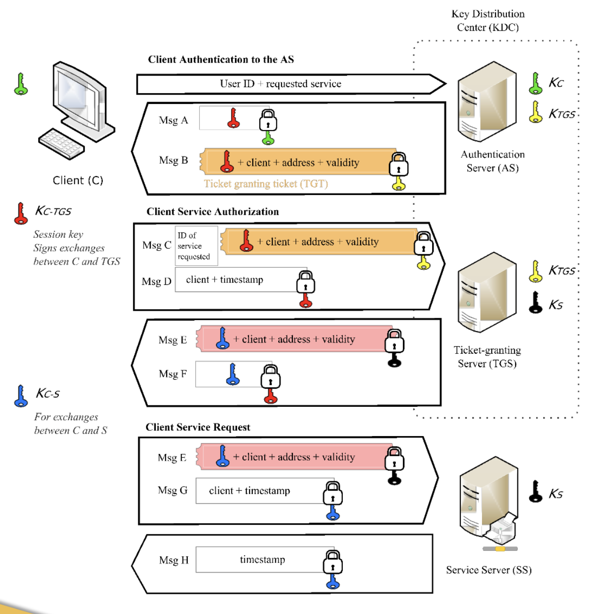

# Module 6: Authentication

## Module 6.1

### What is identity?

- [n] the individual characteristics by which a thing or person is recognized or known
- How do you know who I am?
- How do I know who you are?

### What is a Digital Identity?

- The electronic representation of a real-world entity. The term is usually taken to mean the online equivalent of an individual human being, which participates in electronic transactions on behalf of the person in question. However a broader definition also assigns digital identities to organizations, companies and even individual electronic devices. Various complex questions of privacy, ownership and security surround the issue of digital identity.

### Difference between Authentication and Identity

- Authentication:
  - [n] validating the authenticity of something or someone
  - [n] a mark on an article of trade to indicate its origin and authenticity
- Authentication is the first step in an identity management system

### Authentication

- Proof on identity
- Four different types of authentication
  - User to host
    - Person proves the identity to computer resource
    - Most prevalent
  - Host to Host
    - Work being done to strengthen this
    - In past usually done by IP address
  - User to User
    - Contracts, secure email
    - Useful for online auctions
  - Host to User
    - Server authenticating to user

### User to Host

- Three ways
  - By something that you are
    - Fingerprints, voice prints, thermal imaging
    - Social and technology issues
    - Privacy issues
      - DNA scanning
    - Scalability
  - By something that you know
    - Secret keep by you like a password or pin
    - Most common user to host authentication
    - Problem is human memory
  - By something that you have
    - Key cards like atm card
    - Can be lost or stolen

### Authentication Systems

- Password
- Trusted third party
- Public key infrastructure (PKI)

### Passwords

- Static passwords
  - Remains valid until user changes it
- One time passwords
- Passwords not stored in clear text
  - Use one-way algorithms to store password
- Password guessing
  - Users choose easy passwords
  - Use social engineering to have user change password to something known
- Password decryption
  - Sophisticated password guessing by using the encrypted password file

### UNIX Password Encryption

- UNIX password encryption (old way)
  - 56 bit password
    - Brute force attack 2^56 = 72,057,594,037,927,936
    - To break in a day 833,999,930,994 /sec
    - To break in a year 2,284,931,317 /sec
  - Usually systems will only allow 3-5 mistakes
    - Some of these attempts might be logged
- Ways to narrow down domain of problem
  - Social engineering
- Password decryption
  - One must have obtained a password file or database
  - Sniff information of the media
    - Challenge and response
- Password can be in clear text
  - Sniffers to look for user names and passwords on the media

### Password Decryption

- Need to obtain password file
  - Different operating systems secure this differently
  - Sniff a challenge and response
- Going to look at Unix side

### UNIX World

- Passwords stored in etc/password
  - Contains mapping between username and password
    - Username:password:uid:gid:info:home directory:shell
    - Sometimes password not stored in this file
  - Password stored by one way encryption meaning easy to encrypt difficult to unencrypt
    - Example would be to square a number (easy) and the to find the square root (harder)
- Password and salt get encrypted and a 11 character come out of one way encryption
- To compare user entered password to stored password
  - Encrypt user entered password with salt and compare it to stored password
  - Never unencrypts password
- /etc/passwd needs to be readable to word
  - Anyone who is a valid user on system can read the file
  - Hackers become valid user and grab password file
  - Misconfigurations can take place
    - Trivial ftp and anonymous can be misconfigured to allow password files to be leaked
- Nis can also cause problems
- Numerous other ways to obtain password file
- Once you obtain password file
  - Run crack, jack the ripper, etc…
  - These tools work with the same general principle
    - History
      - 1990, 13797 encrypted passwords were given for the study, 25 percent were broken
        - 15 minutes 3 percent
        - One cpu week 21 percent
        - Cpu year 25 percent
    - Method
      - Clearly cannot try all possible combinations
      - Use info field and variations to obtain password
      - Words from arbitrary dictionary
      - Tries permutations from the dictionary
        - Tries capital letters
        - Tries substitutions 1 into L, 3 into e a into @ etc..
        - International words
        - Parings of sort words
- Defense
  - Shadow password
    - User:password
    - When user logs in Unix checks both files
    - Make only name:uid:gid world readable
  - Correctly configure ftps, https, etc..

### Technologies for Authentication

- Key cards
  - Look like a business card meets a calculator
    - Type in pin number to turn on
    - Asynchronous or challenge and response
      - Secret is in the algorithm
    - Synchronous
      - Based on time, host needs to accept multiple responses as the time moves
      - Positioned based authentication is being worked on using GPS
  - Cards usually allow three tries
- Smart cards
  - Slow in gaining acceptance as an authenticator
  - Direct interface, the user plugs the card into the reader
  - Pin number or finger print technology
  - Can carry large sums of information
  - Generally considered more secure
- Software
  - Skey
    - One time password

### One time password

- Designed by Bell Labs
  - Created for people who traveled and did not have the security of the work place
- Based on a one way hash
  - Determine the number of keys in the sequence
  - The longer the sequence the better, in the order of one hundred
  - It will generate a series of keys that are one hash of the previous keys
    - P1 = hash(password) password can be very long
    - P2 = hash(P1 or hash(password))
    - P3 = hash(p2) and so on
    - Last key is stored in a file, in this example P3 is stored
    - User would write down keys P1 and P2
    - The first key to use is P2, P2 is then put in file if the hash of P2 = P3
    - The second key to use is P1 and that is hashed and compared to P2
  - How to break Skey
    - Can be attacked with a program like monkey, but this method is much more secure

### Trusted Third Party

- Put trust in one place
  - Trust no one else
- Both Unix and Microsoft have implemented Kerberos

### Host to Host Authentication

- Many security systems are based on Host authentication.
  - Firewalls
  - Intrusion detection
- Several services are based on Host authentication.
  - File system mounting
  - Remote backups
- No authentication
  - Host name or Address is no authentication
- Disclosing password
  - No better
- Digital signatures, encryption, Trusted third parties
  - Best method
- Implicit authentication of host
  - Often times IP address or host name is the authentication
- Firewalls, intrusion detection, backup system rely on trusting hosts
- Sometimes password based host to host authentication is used
  - WEB uses symmetric key password for host to host
- Trust third party with digital signatures and encryption are the current technologies to use

### User to User

- Defer discussion until we talk about the application technology
- Digital signatures
  - Public key
  - Trusted third party

### Host to User

- Digital certificates
  - Infrastructure to sign certificates
- Digital signatures
  - This occurs more in software distribution
- Public key encryption
  - There must be a trusted source somewhere
  - Through other certificates can trust other host, from the users perspective

## Module 6.2

### Kerberos

- Developed at MIT
  - Developed under project Athena
- System to exchange system keys
- Version 5
- Supports one and two ways
  - One way user to host
  - Two way host to user
- If both parties use Kerberos then one can authenticate host to host
- Goals of Kerberos
  - No clear text password will be sent on network
  - No clear text password is ever stored on the KDC
  - No local storage of clear text password
    - Keeps password in memory for as short as time possible
  - Limit authentication compromise
    - If single user is compromised, would be limited to that session
  - Finite life time of certificate
  - Transparent to user
  - Minimal modification to application

### Kerberos Definitions

- Principle
  - A user, client program, or a server program
  - Whoever participates in Kerberos
  - Primary name
    - Like an account name
  - Instance
    - Most cases this is null
    - Could be admin or root on local machine but not on others
  - Realm
    - Example IASTATE.EDU
  - Example principle name
    - jones@IASTATE.EDU
  - Server
    - Fred.root@IASTATE.EDU
  - Application
    - Rcmd.sarek@IASTATE.EDU

### Kerberos Server

- Two applications that run on Kerberos server
  - AS
    - Authentication server which has a database of users and authentication information
  - TGS
    - Ticket granting server which is the application that hands out tickets and the ticket authenticates one for services and resources

### Steps

### Overview

- How Kerberos can authenticate users
- [KerberosOverview](./Screenshots/KerberosOverview.png)

