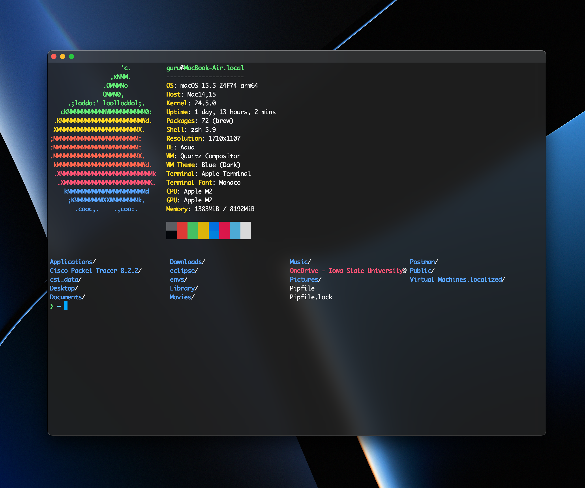
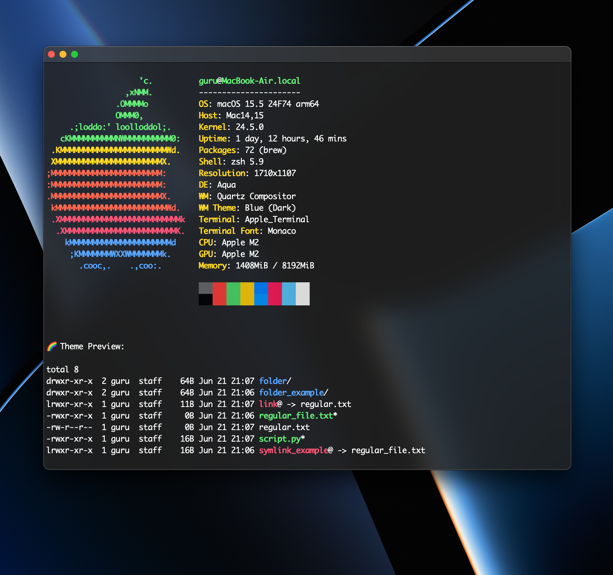
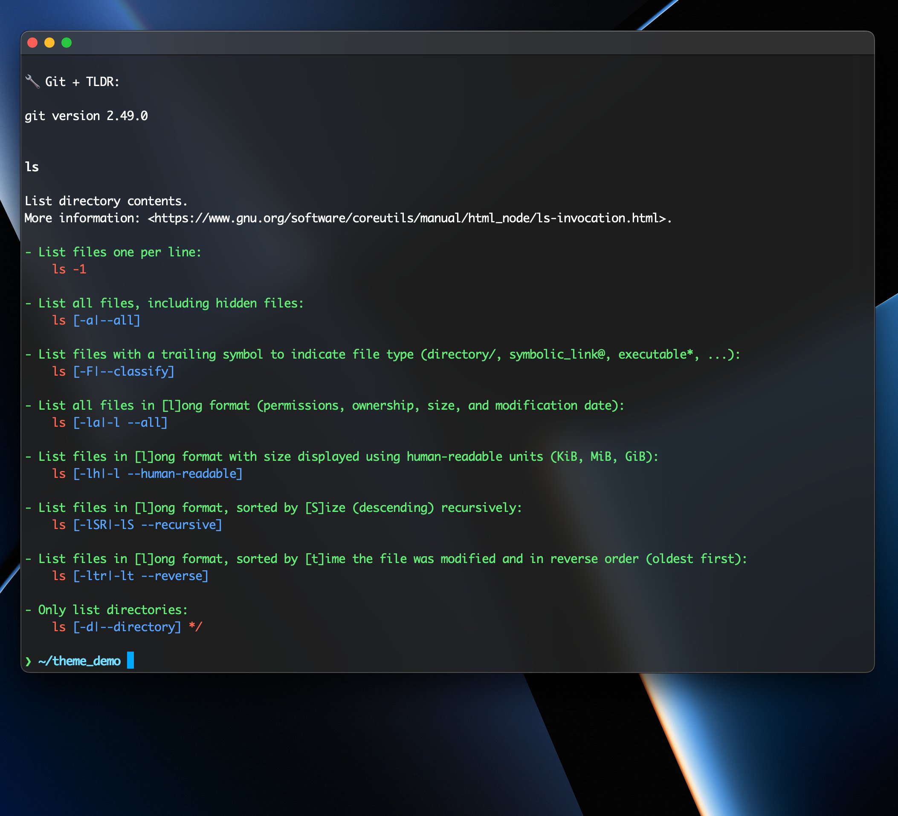

# Frosted Glass — MacOS Terminal Theme ✨

A sleek, semi-transparent `.terminal` theme inspired by Hyper’s **Verminal** aesthetic — with vibrant cursor color, modern fonts, and frosted glass vibes.

## 🔧 Features

- Frosted glass transparency
- Monaco font (14 pt)
- Vibrant blue cursor + directory highlights
- Verminal-inspired color palette
- Polished for daily use

## 📦 Installation

1. Download [`FrostedGlass.terminal`](./FrostedGlass.terminal)
2. Double-click the file to import it into your MacOS Terminal
3. In **Terminal > Settings > Profiles**, select “Frosted Glass” and click **Default**
4. Restart Terminal

## 🖼 Fonts

This theme uses:

- **Monaco**, 14pt — the classic MacOS monospace font known for readability

(Optional alternatives if you wish to customize later):

- [JetBrains Mono](https://www.jetbrains.com/lp/mono/)
- [SF Mono](https://developer.apple.com/fonts/)

## 📸 Preview

## 📄 License

MIT